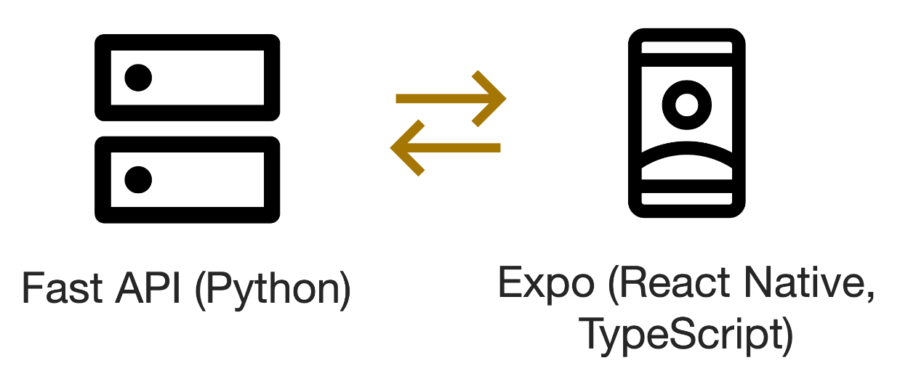
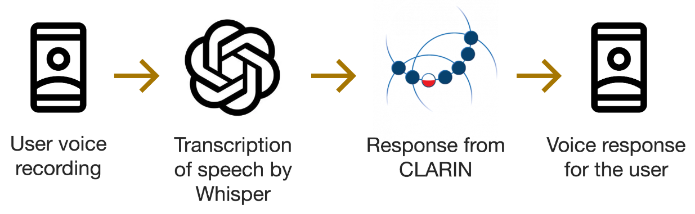

# AI Voice Assistant

1. [Description](#description)
   1. [Features](#features)
   2. [Architecture](#architecture)
   3. [Data Flow](#data-flow)
   4. [Technologies](#technologies)
   5. [External Services](#external-services)
2. [Installation](#installation)
   1. [The backend service](#the-backend-service)
   2. [The frontend service](#the-frontend-service)
3. [Screenshots](#screenshots)


## Description

An easy-to-use framework for testing large language models and voice recognition systems. It provides a complete system for parsing, analyzing and responding to user voice queries in natural language.

### Features

- **Cross-platform**: Supports both web and mobile platforms
- **Fast communication**: Utilizes streaming technologies for delivering the response as fast as possible
- **Silence removal**: Removes silence from user voice recordings, ensuring seamless and smooth voice transcription
- **User-friendly interface**: Provides a user-friendly interface for interacting with the system, allowing users to easily understand the system's responses
- **Easy to customize**: Allows users to easily customize the system by adding support for new large language models

### Architecture



The system is composed of two primary components: a backend service responsible for processing the user's voice input and a frontend service that provides a cross-platform and user-friendly interface for interacting with the system.

### Data Flow



The user's voice is recorded on-device by the frontend application and sent to the backend service for further analysis. The backend service is responsible for removing silence from the recording with [FFMPEG](https://ffmpeg.org/) and [pydub](https://github.com/jiaaro/pydub) Python library, transcribing the user's query, and generating a response. The response is then streamed back with WebSockets to the frontend service, which is responsible for presenting the information to the user in an easy-to-understand manner, both visually and audibly. An [expo-av](https://docs.expo.dev/versions/latest/sdk/av/) library is used for text-to-speech playback. The system prioritizes fast communication and seamless user experience.

### Technologies

- [FastAPI 0.110](https://fastapi.tiangolo.com/), [Python 3.12](https://www.python.org/)
- [Expo 50.0](https://docs.expo.dev/), [React Native 0.73](https://reactnative.dev/), [TypeScript 5.4](https://www.typescriptlang.org/)
- [FFMPEG 3.4](https://ffmpeg.org/)
- [Docker 20.10](https://docs.docker.com/), [Docker Compose](https://docs.docker.com/compose/)

### External Services

As of 06.2024, the system relies on [Clarin](https://clarin-pl.eu/), a pan-European scientific infrastructure, for transcribing the user's voice queries and generating a response. Voice transcription is performed with the use of [Whisper](https://openai.com/index/whisper/), OpenAI's open-source voice recognition model, while the response is generated with the use of [OpenChat](https://github.com/imoneoi/openchat), an open-source LLM.

Communication with Clarin API is based on OpenAPI 3.0 specification.

## Installation

As established above, the project is composed of two primary components: a cross-platform frontend service and a backend service.

In order to run both services execute the following commands in the project directory:

```bash
docker-compose up --build
```

Please keep in mind that a running instance of [Docker Engine 20.10+](https://docs.docker.com/) is required.

After the services are up and running, you can access the frontend service by navigating to `localhost:8081` in your web browser of choice. Additionally, it can be accessed from a mobile device by navigating to `{ip}:8081`, where `ip` stands for the local IP address of the machine running the services.

### The backend service

> [!NOTE]
> In order to start the backend service, you need to set the `CLARIN_API_KEY` environment variable with your Clarin key. Please refer to provided `.env.example` file for more details. A valid environment file should be named `.env` and placed in the root directory of the project.

- Built with [FastAPI](https://fastapi.tiangolo.com/) and Python 3.12
- The service is available on port `8000`

### The frontend service
> [!NOTE]
> In order to start the frontend service, you need to set the `EXPO_PUBLIC_API_URL` environment variable with the address of your running backend service instance. Please refer to provided `.env.example` file for more details. A valid environment file should be named `.env` and placed in the root directory of the project.

> [!WARNING]
> Currently, the web browser experience is only supported on Chrome version 125 and above.

- Built with [Expo](https://docs.expo.dev/) and TypeScript
- The service is available on port `8081`

## Screenshots

| Example question and response              | Response parsing                 | Choosing a large language model                          |
|--------------------------------------------|----------------------------------|----------------------------------------------------------|
|  |  |  |
